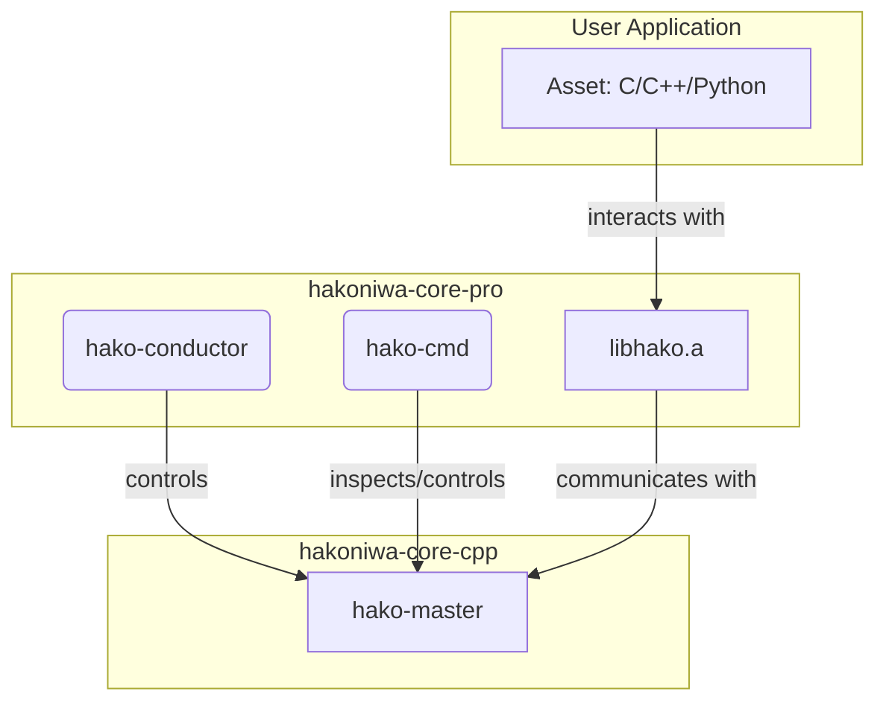

# hakoniwa-core-pro

hakoniwa-core-pro は、箱庭シミュレーションフレームワーク **hakoniwa-core-cpp** を拡張し、
イベント駆動型のシミュレーションを実現するためのライブラリ群です。C/C++/Python で
記述されたアセットを組み合わせることで、ロボット制御やセンサシミュレーションなどの
開発・検証を行うことができます。

## アーキテクチャ

hakoniwa-core-pro は、以下のコンポーネントから構成されています。



- **hako-master**: `hakoniwa-core-cpp` のコアコンポーネント。シミュレーション全体の時間管理やアセット間のデータ同期を担います。
- **libhako.a**: `hakoniwa-core-pro` のコアライブラリ。データ受信イベントやRPCサービスなどの機能を提供し、アセットからのAPI呼び出しを処理します。
- **hako-conductor**: シミュレーションの実行を制御するプログラム。`hako-master` と連携し、シミュレーションの開始、停止、ステップ実行などを管理します。
- **Asset**: ユーザが作成するシミュレーション参加要素。`libhako.a` が提供するAPIを利用して、他のアセットとのデータ送受信や、RPCサービスの利用が可能です。
- **hako-cmd**: シミュレーションの状態を外部から確認したり、操作したりするためのコマンドラインツールです。

## 主な機能

### データ受信イベント

hakoniwa-core-pro では、PDU チャンネルのデータ受信を検知する
"データ受信イベント" 機能を提供しています。アセットは
`hako_asset_register_data_recv_event()` を用いることで特定の論理
チャンネルに対する受信イベントを登録でき、データが書き込まれた
タイミングでコールバックが呼び出されます。コールバックを指定し
ない場合はフラグ方式となり、`hako_asset_check_data_recv_event()` で
受信の有無を確認できます。詳細な使い方は
`examples/pdu_communication` 以下のサンプルを参考にしてください。

#### ユースケース

- **センサデータの非同期受信**: カメラやLiDARなどのセンサデータを、データが到着したタイミングで即座に処理したい場合に利用します。これにより、ポーリングによる無駄なCPU消費を抑えることができます。
- **アセット間の状態同期**: あるアセットの状態が変化したことを、他のアセットに即座に通知し、連携した動作を実現します。
- **外部システムとの連携**: シミュレーション外部のシステムからデータを受信し、それをトリガとしてシミュレーション内のアセットを動作させることができます。

#### 主要API

- `hako_asset_register_data_recv_event(channel_id, callback)`
    - **説明:** 指定したPDUチャンネルにデータ受信時のコールバック関数を登録します。
    - **引数:**
        - `channel_id`: 監視対象のチャンネルID。
        - `callback`: データ受信時に呼び出されるコールバック関数へのポインタ。
    - **戻り値:** 成功すれば `HAKO_SUCCESS` 、失敗すればエラーコードを返します。

- `hako_asset_check_data_recv_event(channel_id)`
    - **説明:** (コールバックを登録しない場合) 指定したPDUチャンネルでデータ受信があったかどうかを確認します（フラグ方式）。
    - **引数:**
        - `channel_id`: 確認対象のチャンネルID。
    - **戻り値:** データ受信があれば `true` 、なければ `false` を返します。

### RPCサービス

hakoniwa-core-pro では、PDU を介したリクエスト／レスポンス通信を実現する
"RPC サービス" 機能を提供しています。サービス定義を
`hako_asset_service_initialize()` で読み込み、サーバは
`hako_asset_service_server_create()` によりサービスを登録します。
クライアントは `hako_asset_service_client_create()` を呼び出して接続し、
`hako_asset_service_client_get_request_buffer()` でリクエストを準備して
`hako_asset_service_client_call_request()` で送信します。サーバ側では
`hako_asset_service_server_poll()` でリクエスト到着を検知し、
`hako_asset_service_server_get_request()` でデータを取得したのち、
`hako_asset_service_server_get_response_buffer()` と
`hako_asset_service_server_put_response()` を用いて応答を返します。
クライアントは `hako_asset_service_client_poll()` で応答を確認し、
`hako_asset_service_client_get_response()` から結果を取得できます。
詳細な使い方は `examples/service` 以下のサンプルを参照してください。

#### ユースケース

- **ロボットへの動作指令**: 制御ノードからロボットアームや移動ロボットに対して、「アームをこの角度に動かせ」「この座標に移動しろ」といった具体的な動作を指令し、その完了を待ち合わせるような場合に利用します。
- **シミュレーション環境からの情報取得**: アセットがシミュレーション環境（例：物理エンジン）に対して、「現在の自己位置を取得したい」「障害物との距離を知りたい」といった情報を要求し、結果を取得します。
- **パラメータ設定**: シミュレーション実行中に、外部ツールからアセットのパラメータ（例：ゲイン、閾値など）を動的に変更する場合に利用します。

#### 主要API (クライアント側)

- `hako_asset_service_client_create(service_name)`
    - **説明:** RPCサービスのクライアントを作成し、サーバに接続します。
    - **引数:** `service_name`: 接続するサービス名。
    - **戻り値:** 成功すればクライアントハンドル、失敗すれば `NULL` を返します。

- `hako_asset_service_client_call_request(client, request, size)`
    - **説明:** サーバにリクエストを送信します。
    - **引数:**
        - `client`: クライアントハンドル。
        - `request`: 送信するリクエストデータへのポインタ。
        - `size`: リクエストデータのサイズ。
    - **戻り値:** 成功すれば `HAKO_SUCCESS` 、失敗すればエラーコードを返します。

- `hako_asset_service_client_poll(client)`
    - **説明:** サーバからのレスポンスが到着したかを確認します。
    - **引数:** `client`: クライアントハンドル。
    - **戻り値:** レスポンスがあれば `true` 、なければ `false` を返します。

#### 主要API (サーバ側)

- `hako_asset_service_server_create(service_name, pdu_size)`
    - **説明:** RPCサービスを登録し、サーバとして待機します。
    - **引数:**
        - `service_name`: 公開するサービス名。
        - `pdu_size`: このサービスで送受信するPDUの最大サイズ。
    - **戻り値:** 成功すればサーバハンドル、失敗すれば `NULL` を返します。

- `hako_asset_service_server_poll(server)`
    - **説明:** クライアントからのリクエストが到着したかを確認します。
    - **引数:** `server`: サーバハンドル。
    - **戻り値:** リクエストがあれば `true` 、なければ `false` を返します。

- `hako_asset_service_server_put_response(server, response, size)`
    - **説明:** 処理結果をクライアントに返します。
    - **引数:**
        - `server`: サーバハンドル。
        - `response`: 返信するレスポンスデータへのポインタ。
        - `size`: レスポンスデータのサイズ。
    - **戻り値:** 成功すれば `HAKO_SUCCESS` 、失敗すればエラーコードを返します。

## ディレクトリ構成

- `sources/`: コアライブラリおよびアセット用モジュール
    - `core/`: 静的ライブラリ `libhako.a` のソースコード。データ受信イベントやRPCサービスなどのコア機能を提供します。
    - `assets/`: アセットが利用する共有ライブラリ `libasset.so` のソースコード。
    - `conductor/`: シミュレーション実行を制御する `hako-conductor` のソースコード。
    - `command/`: コマンドラインツール `hako-cmd` のソースコード。
- `examples/`: サンプルプログラム
- `tests/`: Python 版バインディングのテストコード

## コアライブラリの設計 (`sources/core`)

`sources/core` ディレクトリには、`libhako.a` 静的ライブラリを構成するコアなソースコードが含まれています。このライブラリは、`hakoniwa-core-cpp` の基本機能の上に、より高度なイベント駆動の仕組みとサービス指向の通信機能を提供します。

### 主要コンポーネント

*   **`HakoProData`**:
    *   `hakoniwa-core-cpp` の `HakoMasterData` を拡張し、共有メモリを介してサービスやイベントに関する情報を管理する中心的なクラスです。
    *   `IHakoMasterExtension` インターフェースを実装し、Hakoniwa のマスターライフサイクル（PDUの生成、読み込み、リセットなど）と連携して動作します。

*   **サービス (RPC) フレームワーク**:
    *   アセット間の非同期なリクエスト/レスポンス型通信を実現するためのフレームワークです。
    *   **インターフェース**:
        *   `IHakoServiceClient`: サービスを利用するクライアントが実装すべき純粋仮想ベースクラスです。
        *   `IHakoServiceServer`: サービスを提供するサーバーが実装すべき純粋仮想ベースクラスです。
    *   **プロトコル実装**:
        *   `HakoServiceClientProtocol`: `IHakoServiceClient` をラップし、リクエスト送信、レスポンス受信、タイムアウト処理、状態管理（`IDLE`, `DOING`, `CANCELING`）などのクライアント側プロトコルを実装します。
        *   `HakoServiceServerProtocol`: `IHakoServiceServer` をラップし、リクエスト受信、レスポンス返信、状態管理などのサーバー側プロトコルを実装します。
    *   **通信プロトコル**:
        *   `hako_service_protocol.hpp` にて、操作コード (`REQUEST`, `CANCEL`)、ステータス (`DOING`, `DONE`)、リザルトコード (`OK`, `ERROR`) が定義されており、これらを用いて通信を制御します。

*   **データ受信イベント**:
    *   `HakoProData` は、特定のPDUチャネルへのデータ書き込みを検知し、登録されたコールバック関数を呼び出すイベント機能を提供します。
    *   イベント情報は `HakoRecvEventTableType` という共有メモリ上のテーブルで管理されます。

## ビルド方法

```sh
./build.bash
```

デフォルトでは `cmake-build` 配下にビルド成果物が生成されます。初回のみ
`git submodule update --init --recursive` を実行してサブモジュールを取得してください。

## インストール

ビルドが完了した後、以下のスクリプトを実行することで、Hakoniwaのライブラリと実行ファイルをシステムにインストールできます。

```sh
./install.bash
```

このスクリプトは、`/usr/local/bin` や `/usr/local/lib` などの標準的なディレクトリにファイルをコピーします。管理者権限が必要なため、実行中に `sudo` のパスワードを求められることがあります。

なお、Pythonのサンプルコードを実行する場合は、以下のコマンドを実行して、Pythonライブラリをインストールしてください。

```sh
pip install hakoniwa-pdu
```

### アンインストール

インストールされた Hakoniwa をシステムから削除するには、以下のスクリプトを実行します。

```sh
./uninstall.bash
```

このスクリプトは、`install.bash` によって作成されたディレクトリとファイルをすべて削除します。安全のため、実行前に削除対象のディレクトリ一覧を表示し、確認を求めます。

### インストール状況の確認

以下のスクリプトを実行すると、Hakoniwaが正しくインストールされているかを確認できます。

```sh
./check-install.bash
```

このツールは、必要なファイルやディレクトリがすべて揃っているかをチェックし、結果を報告します。不足している項目がある場合は、その一覧が表示されます。

## Debianパッケージのビルド

### 1. ビルド環境のセットアップ

Debianパッケージをビルドするには、ビルド依存関係を満たすパッケージが必要です。
`debian/control`の`Build-Depends`に記載されているパッケージを、以下のコマンドなどを用いてインストールしてください。

```sh
sudo apt-get update
sudo apt-get install build-essential devscripts debhelper-compat cmake dh-exec help2man dh-sequence-python3 python3-dev
```

### 2. ビルドの実行

リポジトリのルートディレクトリで以下のコマンドを実行します。

```sh
dpkg-buildpackage -us -uc
```

### 3. 成果物

ビルドが成功すると、親ディレクトリ（一つ上の階層）に`.deb`ファイル群が生成されます。

## 実行方法

ビルド後、サンプルを以下のように実行できます。

```sh
./run-example.bash ./cmake-build/examples/hello_world/hello_world
```

詳細な手順は `examples/hello_world/README.md` など各サンプルの README を参照してください。


## 作成されるライブラリ/コマンド内訳

|分類|名前| 説明| 利用者|
|---|---|---|---|
|ライブラリ|assets| 箱庭アセット用ライブラリ(callback)| C++ 開発者|
|ライブラリ|conductor| 箱庭コンダクタ用ライブラリ| C++ 開発者|
|ライブラリ|shakoc| 箱庭アセット用ライブラリ(polling)| Unity 開発者|
|ライブラリ|hakopy| Python バインディング| Python 開発者|
|コマンド|hako-cmd|箱庭コマンドラインツール| C/C++/Python 開発者|

ファイル名は、OSによって異なります。

- Windows: <ライブラリ名>.dll, <コマンド名>.exe
- Linux: <ライブラリ名>.so, <コマンド名>
- MacOs: <ライブラリ名>.dylib, <コマンド名>

## Linux/MacOSの場合の内部開発向けファイル配置場所

|分類|リポジトリ内|インストール先| 説明| 利用者|
|---|---|---|---|---|
|ヘッダファイル|include|/usr/include/hakoniwa|箱庭APIのヘッダファイル| C/C++ 開発者|
|ヘッダファイル|hakoniwa-ros2pdu/pdu/types|/usr/include/hakoniwa/pdu|箱庭PDUバイナリ変換APIのヘッダファイル| C/C++ 開発者|
|実行時参照ファイル|hakoniwa-ros2pdu/pdu/offset|/usr/share/hakoniwa/offset|箱庭PDUバイナリ変換用オフセットファイル| C/C++ 開発者|
|MMAPファイル|なし|/var/lib/hakoniwa/mmap|MMAPファイルを配置するディレクトリ| 箱庭ライブラリ利用者|
|設定ファイル|hakoniwa-core-cpp/cpp_core_config.json|/etc/hakoniwa/cpp_core_config.json|箱庭コアの設定ファイル| 箱庭ライブラリ利用者|
|ライブラリ|cmake-build/sources/assets/callback|/usr/local/lib/hakoniwa/|箱庭アセット用ライブラリ(callback)| C++ 開発者|
|ライブラリ|cmake-build/sources/conductor|/usr/local/lib/hakoniwa/|箱庭コンダクタ用ライブラリ| C++ 開発者|
|ライブラリ|cmake-build/sources/assets/bindings/python|/usr/local/lib/hakoniwa/|Python バインディング| Python 開発者|
|コマンド|cmake-build/sources/command/hako-cmd|/usr/local/bin/|箱庭コマンドラインツール| C/C++/Python 開発者|


## ライセンス

このプロジェクトは MIT License の下で公開されています。詳しくは `LICENSE` ファイルを参照してください。

# 参考

## apt公開を見据えたDebianパッケージ版hakoniwa-core-proのバージョン管理まとめ

---

### 1. バージョン番号の構成

```
[Upstreamバージョン] - [Debianリビジョン] ~ [PPAビルド番号]
```

例： `1.0.0-1~ppa1`

* **Upstreamバージョン（1.0.0）**
  → ソフトそのものの機能や仕様が変わった時に上げる（コード変更）
* **Debianリビジョン（-1）**
  → パッケージの作り方や構成を変えた時に上げる（配置・依存・ビルド方法など）
* **PPAビルド番号（\~ppa1）**
  → PPA内での世代番号。テスト配布や小修正時に上げる
  `~` があることで、公式版が出ると自動でそちらに置き換わる

---

### 2. Debianリビジョンを上げる具体例

* **インストール先の変更**

  * `/usr/local/lib` → `/usr/lib/<multiarch>`
  * 設定ファイルのパス変更
* **依存関係の追加・削除**

  * `Depends: libfoo1` → `Depends: libfoo2`
  * 不要な依存を削除
* **パッケージの分割・統合**

  * `-dev` とランタイムパッケージの分離
* **ビルドオプションの変更**

  * 最適化レベル変更、特定アーキ用最適化
* **パッチ適用**

  * バグ修正、セキュリティパッチ
* **メタデータ修正**

  * 説明文、Maintainer、Homepageの更新

---

### 3. 運用方針例

* **初期配布（PPAのみ）**

  * `1.0.0-0~ppa1` から開始（公式化前はDebianリビジョン0）
* **PPAでの小修正**

  * `1.0.0-0~ppa2` → `1.0.0-0~ppa3`
* **公式リリース時**

  * `1.0.0-1` に昇格（PPAの数字は消える）
* **公式版のDebianリビジョン更新**

  * パッケージ構成を修正したら `1.0.0-2`

---

### 4. hakoniwa-core-pro のapt化で最初に決めること

1. **パッケージ名**

   * `hakoniwa-core`（統合） or `hakoniwa-core` + `hakoniwa-core-dev`（分割）
2. **インストールするもの**

   * `.so`（SONAMEリンク付き）
   * ヘッダ
   * 設定ファイル
   * コマンド
   * 必要なら`hakopy`
3. **配置場所**

   * `/usr/lib/<multiarch>`（ライブラリ）
   * `/usr/include/hakoniwa`（ヘッダ）
   * `/etc/hakoniwa`（設定）
   * `/usr/bin`（コマンド）
4. **初期バージョン**

   * 公式化前：`X.Y.Z-0~ppa1`
   * 公式化後：`X.Y.Z-1`

---

💡 このルールを最初に決めておくと、**apt公開・PPA配布・ローカルテスト**の全部に対応できる。
